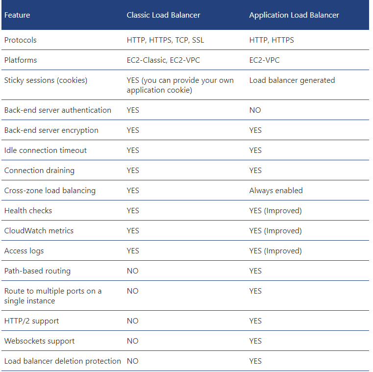

# AWS Certfied Cloud Practitioner

#### Cloud Computing

-   On-demand delivery of IT resources. Can scale up and down based on needs.
-   Fosters agility (number one reason why customers switch to cloud computing): Speed (global reach), experimentation (operations as code, templated environments with CloudFormation) and culture of innovation (experiment quickly with low cost)
-   Region vs Availability Zone (AZ): Region is a physical location in the world which contains multiple AZs. AZs contain one or more discrete data centers with independent resources and housed in different facilities.
-   Using Auto Scaling and ELB, scale up and down and only pay for what you use.
-   Ability to deploy systems in multiple regions (lower latency)
-   Ability to choose the region where data is stored
-   AWS is responsible for data center security
-   Security policy can be formalized (as code)
-   Ability to recover from failures

#### Core Services

-   Global Infrastructure:
    -   Regions: Have multiple AZs
    -   Availability Zones: Have one or more data centres. They all have different power supplier companies.
    -   Edge Locations: Used by CloudFront.
-   Amazon Virtual Private Cloud (VPC)
    -   Uses same concepts as on-premise networking
    -   VPC can span across multiple AZs
    -   Supports multiple subnets (each of which can be deployed in a different AZ)
    -   Can create public-facing subnets and private-facing subnets within the same VPC
    -   Each account can create multiple VPCs
    -   Using fewer VPCs is recommended to avoid complexity
    -   Can assign Internet Gateways to specific subnets to allow public access
    
-   Security Groups
    -   Act like a built-in firewall
    -   Best practice: Allow what's required only and block everything else
-   Compute Services
    -   Amazon Lightsail: Managed Virtual Private Servers service
        -   Fixed price.
        -   Includes a static IP, DNS management and storage
        -   Fixed configuration
        -   Uses t2 class EC2 instances under the hood
    -   AWS Elastic Compute Cloud (EC2)
        -   Difference betwwen EC2-Classic and EC2-VPC
            -   EC2-Classic: Your instances run in a single, flat network that you share with other customers.
            -   EC2-VPC: Your instances run in a virtual private cloud (VPC) that's logically isolated to your AWS account.
    -   AWS Lambda
        -   No servers to manage
        -   Pay as you go: Only pay for the time your code runs
        -   Continuous scaling
        -   Supports subsecond metering. Charged for every 100 milliseconds of execution time
        -   Some limitations apply: [AWS Lambda Limits](https://docs.aws.amazon.com/lambda/latest/dg/limits.html)
    -   AWS Elastic Beanstalk
        -   Platform as a service
        -   Allows quick deployments of applications
        -   Allows HTTPS on load balancers
        -   Supports various platforms (node.js, python etc)
        -   Provisions the resources required (EC2, ELB etc) automatically
    -   Application Load Balancer
        -   Comes with new features

        -   Supports routing to containers
        -   Key terms:
            -   Listeners: A process that checks for connection requests using the configuration (protocol, port)
            -   Target: Destination for traffic
            -   Target Group: Each target group routes requests to one or more registered targets
        -   Target checks can be performed per target group basis
        -   Integrates with ECS and supports dynamic ports utilized by scheduled containers
        -   Need to create at least 2 AZs when creating an Application Load Balancer
        -   Ability to route to different target groups based on port or path
    -   Elastic Load Balancer
        -   Supports sticky sessions
        -   Supports multiple AZs and cross-zone balancing
        -   For HTTP/HTTPS it uses "Least Outstanding" method to route the request. For TCP, it uses "Round robin". The least outstanding routing algorithm is defined as "A 'least outstanding requests routing algorithm' is an algorithm that choses which instance receives the next request by selecting the instance that, at that moment, has the lowest number of outstanding (pending, unfinished) requests."
    -   Auto Scaling
        -   Adding more instances: Scaling out, terminating instanes: Scaling in
        -   Launch configuration answers "What" (AMI, Instance type, Security Groups, Roles). Creating an LC is similar to creating a new EC2 instance.
        -   Auto Scaling Group answers "Where" (VPC and subnet(s), load balancer, minimum and maximum instances, desired capacity)
        -   Auto Scaling Policy answeres "When" (Scheduled/on-demand/scale out or in policy)
-   Amazon EBS
    -   Allows point-in-time snapshots and creation of a new volume from a snapshot
    -   Supports encrypted volumes free of charge
    -   EBS volume must be created in the same AZ as the EC2 instance that will use it
-   Amazon S3
    -   Objects are stored redundantly across multiple facilities withing the same region
    -   The bucket names must be globally unique.
    -   Can configure cross-region replication for backup and disaster recovery
    -   Amazon S3 Transfer Acceleration enables fast, easy, and secure transfers of files over long distances between your client and an S3 bucket
-   Amazon Glacier
    -   Vaults have access and lock policies attached to them
    -   Each AWS account can create up to 1000 vaults
    -   Can create an S3 lifecycle policy to move to Glacier then delete after a period of time
        -   Supports up to 40TB max item size (S3 supports 5TB)
        -   It costs more per retrieval
        -   Vault Lock allows you to easily deploy and enforce compliance controls for individual Amazon Glacier vaults with a vault lock policy. You can specify controls such as "write once read many" (WORM) in a vault lock policy and lock the policy from future edits. Once locked, the policy can no longer be changed
-   Amazon RDS
    -   Can create a standby copy in a different AZ within the same VPC
    -   Can create multiple read replicas (in different regions as well)
-   Amazon DynamoDB
    -   Always uses SSD for storage
    -   Supports auto-scaling. Increases/decreases the throughput based on load
    -   Tables are partitioned by primary key
    -   Two query methods: Query and Scan
    -   Query uses the primary key to find items. Scan can use any attribute.
    -   Scan is slower than Query as it needs to look at all items
-   Amazon Redshift
    -   Managed data warehouse
    -   Supports standard SQL
    -   Supports ODBC/JDBC connectors
-   Amazon Aurora
    -   Managed MySQL-clone (compatible with MySQL)
    -   After a crash it doesn't need to redo log files. It performs it on every read operation which reduces the restart time
-   AWS Trusted Advisor
    -   Checks all the resources used and gives advice based on best practices
    -   5 categories:
        -   Cost optimisation
        -   Performance
        -   Security
        -   Fault tolerance
        -   Service limits
    -   Upgrading support plan enables all Trusted Advisor recommendations, free plan doesn't include all
    -   Has an API and can be used to automate optimisations
    -   Can use it with CloudWatch alarms

#### Security

-   The AWS Shared Responsibility Model
    -   AWS handles infrastructure security
    -   AWS provides 3rd party audit reports
    -   AWS's responsibilities include: OS and database patching, firewall configuration and disaster recovery
    -   Customer is responsible for putting logical access controls in place and protect account credentials
    -   Customers are responsible to secure everything they put in the cloud
-   AWS Service Catalog
    -   Allows to centrally manage common IT services that are approved for use on AWS
-   AWS IAM
    -   Controls access to AWS resources
    -   Handles Authentication (who can access resources) and authorization (how they can use resources)
    -   Users can have programmatic access and/or console access.
    -   Best practices
        -   Delete root account keys. Instead use IAM accounts
        -   Use MFA
        -   Use groups
        -   Use roles
        -   Rotate credentials
        -   Remove unnecessary users
-   AWS Security Compliance Programs
    -   Risk Management: Follow the following standards:
        -   COBIT
        -   AICPA
        -   NIST
    -   Constantly scans service endpoints for vulnerabilities
    -   Compliance programs are listed [here](https://aws.amazon.com/compliance/programs/)
-   AWS Security Resources
    -   AWS Trusted Advisor: Helps to follow best practices
    -   AWS Account Teams: First point of contact
    -   AWS Enterprise Support: 15-minute response time, 24x7 availability
    -   AWS Partner Network
    -   AWS Advisories and Bulletins
    -   AWS Auditor Learning Path
    -   AWS Compliance Solutions Guide: <https://aws.amazon.com/compliance/solutions-guide/>
    -   AWS Security Blog: <https://aws.amazon.com/blogs/security/>

#### Architecting

-   Well-architected framework: <https://aws.amazon.com/architecture/well-architected/>
-   Fiver pillars of the framework
    -   Operational excellence
    -   Security
    -   Reliability
    -   Performance efficency
    -   Cost optimization
-   Fault Tolerance
    -   Remain operational even if components fail
    -   Built-in redundancy of an application's components
-   High-Availability
    -   A concept for the whole system
    -   "Always" functioning and accessible
    -   Without human intervention
    -   HA Service Tools
        -   Elastic Load Balancer
        -   Elastic IP Addresses
        -   Amazon Route 53
        -   Auto Scaling
        -   Amazon CloudWatch

#### Pricing and Support

-   Core concepts in billing
    -   Pay as you go: No up front expenses
    -   Pay less when you reserve: Reserved instances cost less
    -   Pay even less per unit by using more: Tiered pricing for services such as S3, EC2 etc. Data transfer in is always free of charge.
    -   Pay even less as AWS grows
-   Amazon RDS Costs
    -   Clock hours of server time
    -   Database characteristics
    -   Database purchase type
    -   Number of DB instances
    -   Provisional storage
        -   No charge for backup storage of up to 100% of database storage for active databases. After terminated, the backups are charged
    -   Additional storage
    -   Requests
    -   Deployment type
    -   Data transfer
